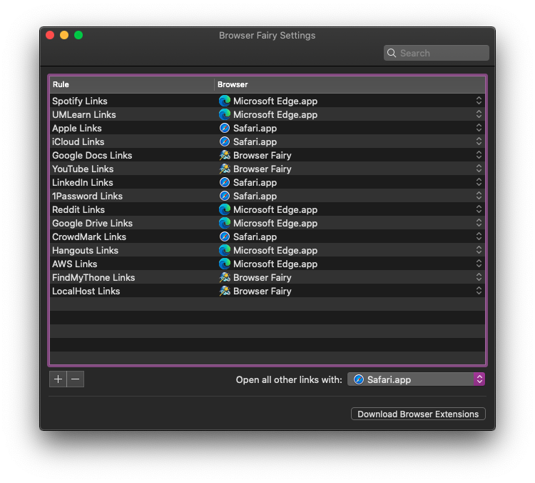

# Restoring Environment

## Terminal Setup :computer:

If for some reason you want to use bash (you don't do that anymore remember? :joy:) your old bash profile is [here](../data/.bash_profile).

Your zsh profile is [here](../data/.zshrc) although, you don't need to copy this one, all of it is generated by the setup below, except for the aliases at the very bottom (and other changes we make throughout this setup).

### Setting Up Homebrew 🧪

Install Homebrew by running the command at the following [website](https://brew.sh).

```shell
/bin/bash -c "$(curl -fsSL https://raw.githubusercontent.com/Homebrew/install/master/install.sh)"
```

### Setting up OhmyZsh :hammer_and_wrench:

Follow the instructions to install OhmyZsh from their [website](https://ohmyz.sh).

```shell
sh -c "$(curl -fsSL https://raw.github.com/ohmyzsh/ohmyzsh/master/tools/install.sh)"
```

### Setting up the Spaceship Prompt for OhmyZsh :space_invader:

Follow the instructions from the spaceship prompt [readme](https://github.com/denysdovhan/spaceship-prompt).

```shell
brew install node
npm install -g spaceship-prompt
```

#### Font Setup

To get all the functionality of the Spaceship prompt, you need to install the FiraCode font. Follow the instructions [here](https://github.com/tonsky/FiraCode/wiki/Installing).

### Setting up SSH Keys :key:

**Note**: Since this involves interfacing with GitHub, you will likely need to setup 1Password and other applications first. I will leave the order of operations up to your discretion :wink:.

#### Setting up SeKey

Follow the instructions from the SeKey [readme](https://github.com/sekey/sekey).

##### Installation of SeKey

```shell
brew cask install sekey
```

#####  Append the following line to `~/.zshrc`

I added this to the top actually :smirk:.

```shell
export SSH_AUTH_SOCK=$HOME/.sekey/ssh-agent.ssh
```

##### Create a `~/.ssh/config`

```shell
IdentityAgent ~/.sekey/ssh-agent.ssh

Host github.com
  User diljotsg
  Hostname github.com
  IdentityFile ~/.ssh/id_github.pub
  IdentitiesOnly yes

Host aviary.cs.umanitoba.ca
  User garchads
  Hostname aviary.cs.umanitoba.ca

Host rodents.cs.umanitoba.ca
  User garchads
  Hostname rodents.cs.umanitoba.ca
```

**Note**: We will have to create the SSH keys referenced in the config file above later. The first line of this file is what we had to add to use SeKey.

#### Generating SSH Keys with SeKey

Generate an SSH key using SeKey, this one will be used to interface with GitHub

```shell
sekey --generate-keypair "GitHub Key"
```

List the keys stored in the secure enclave

```shell
sekey --list-keys
```

Export the GitHub Public Key to a file

```shell
cd ~/.ssh
sekey --export-key [Key ID (must be copied when you list keys)] > ~/.ssh/id_github.pub
```

Now copy the contents of the Public Key and add it to your SSH keys in the GitHub Settings. Be sure to delete any unused SSH keys at this point.

#### Generating SSH Keys (Standard Method)

[Generating SSH Keys in a more standard way](https://docs.gitlab.com/ee/ssh/README.html#generating-a-new-ssh-key-pair).

You can repeat these instructions for other hosts you might want keys for (other than GitHub).

## Directory Setup :file_folder:

Create the `Developer` folder within the user folder and add it to your sidebar. Inside here create a `Git` folder (this is where you will clone Git repos).

These are the two folders you want to create.

- `/Users/diljot/Developer`
- `/Users/diljot/Developer/Git`

## Application Setup

You can install most of your needed applications from the App Store or by using Brew.

**Note**: This is not a list of all the application you ever need/use, just the basics, it includes most of them. Some applications have been excluded from this list, if you ever need those ones, visit the App Store and manually install them (see your purchases for other apps you haven't installed).

### App Store Application List (includes Safari Extensions): :apple:

- [1Blocker (Safari)](https://apps.apple.com/ca/app/1blocker-for-safari/id1107421413?mt=12)
- [1Password](https://apps.apple.com/ca/app/1password-7-password-manager/id1333542190?mt=12)
- [Affinity Photo](https://apps.apple.com/ca/app/affinity-photo/id824183456?mt=12)
- [Amphetamine](https://apps.apple.com/ca/app/amphetamine/id937984704?mt=12)
- [Browser Fairy](https://apps.apple.com/ca/app/browser-fairy/id483014855?mt=12)
- [DuckDuckGo (Safari)](https://apps.apple.com/ca/app/duckduckgo-privacy-essentials/id1482920575?mt=12)
- [GoodNotes](https://apps.apple.com/ca/app/goodnotes-5-notes-pdf/id1480793815?mt=12)
- [Keynote](https://apps.apple.com/ca/app/keynote/id409183694?mt=12)
- [Messenger](https://apps.apple.com/ca/app/messenger/id1480068668?mt=12)
- [Microsoft Office](https://apps.apple.com/ca/app-bundle/microsoft-office-365/id1450038993?mt=12)
  - Get only what you need :wink:.
- [Numbers](https://apps.apple.com/ca/app/numbers/id409203825?mt=12)
- [Pages](https://apps.apple.com/ca/app/pages/id409201541?mt=12)
- [Slack](https://apps.apple.com/ca/app/slack/id803453959?mt=12)
- [Step Two](https://apps.apple.com/ca/app/step-two/id1448916662?mt=12)
- [Telegram](https://apps.apple.com/ca/app/telegram/id747648890?mt=12)
- [Todoist](https://apps.apple.com/ca/app/todoist-to-do-list-tasks/id585829637?mt=12)
- [Twitter](https://apps.apple.com/ca/app/twitter/id1482454543?mt=12)
- [WhatsApp](https://apps.apple.com/ca/app/whatsapp-desktop/id1147396723?mt=12)
- [Wipr (Safari)](https://apps.apple.com/ca/app/wipr/id1320666476?mt=12)
- [Xcode](https://apps.apple.com/ca/app/xcode/id497799835?mt=12)

You can install the remainder of your applications with Brew and Brew Cask. There are two scripts in the `scripts` folder in this repo for installing your brews and casks automatically.

You should review the list of brews and casks in the `docs` folder respectively before running these commands.

### Installing Brews :beer:

[Brew List](../data/brew_list.txt).

```shell
cd <path to repo>/scripts
./install_brews.sh
```

### Installing Casks :beers:

[Cask List](../data/cask_list.txt).

```shell
cd <path to repo>/scripts
./install_casks.sh
```

### 1Password Setup :closed_lock_with_key:

How to find your Setup Code from the iOS client to make logging in easier on the Mac. Instructions [here](https://support.1password.com/secret-key/#ios).

### Microsoft Edge Setup :balance_scale:

Install the following extensions (at your discretion, you might not want all of them :smile:). This list is mostly here since Microsoft hasn't built in extension sync yet (oof).

- [Microsoft Editor (Optional)](https://microsoftedge.microsoft.com/addons/detail/hokifickgkhplphjiodbggjmoafhignh)
- [1Password Desktop](https://chrome.google.com/webstore/detail/1password-extension-deskt/aomjjhallfgjeglblehebfpbcfeobpgk)
- [Browser Fairy](https://chrome.google.com/webstore/detail/browser-fairy/ihfblkkmkmcgejfkgmkiipplonimjnec)
- [DuckDuckGo](https://chrome.google.com/webstore/detail/duckduckgo-privacy-essent/bkdgflcldnnnapblkhphbgpggdiikppg)
- [HTTPS Everywhere](https://chrome.google.com/webstore/detail/https-everywhere/gcbommkclmclpchllfjekcdonpmejbdp)
- [uBlock Origin](https://chrome.google.com/webstore/detail/ublock-origin/cjpalhdlnbpafiamejdnhcphjbkeiagm)

#### Browser Fairy Setup :sparkles:

At this point you can also setup your Browser Fairy config. 

## Reset Launchpad :arrow_right_hook:

Now that you've installed everything you need (you'll still need to setup most individual apps, but that's not hard and just a matter of doing it when you open the app for the first time).

Resetting your launchpad layout is a good idea so that everything you've installed is back to a nice alphabetized list :sweat_smile:.

```shell
defaults write com.apple.dock ResetLaunchPad -bool true; killall Dock
```
